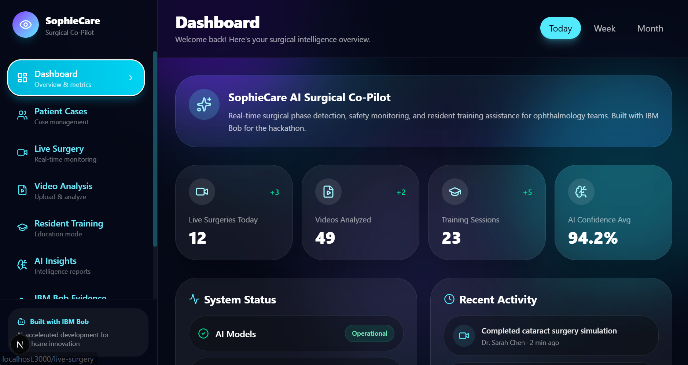
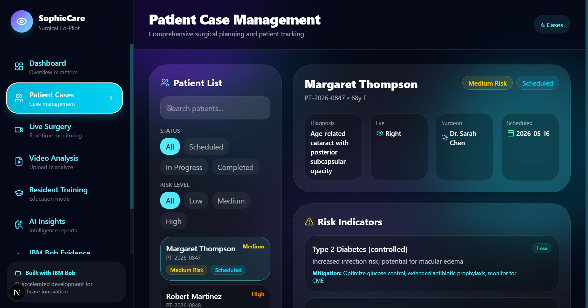
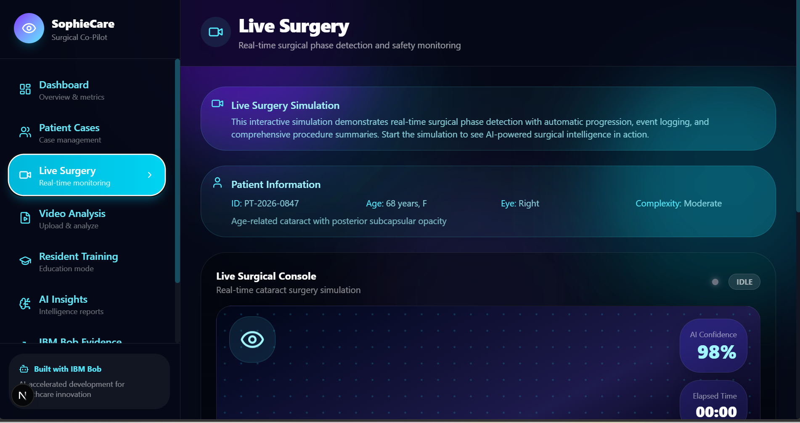
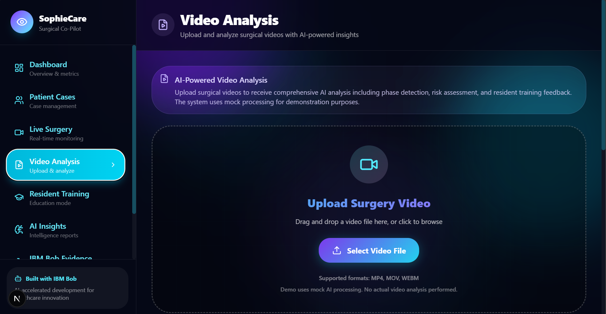
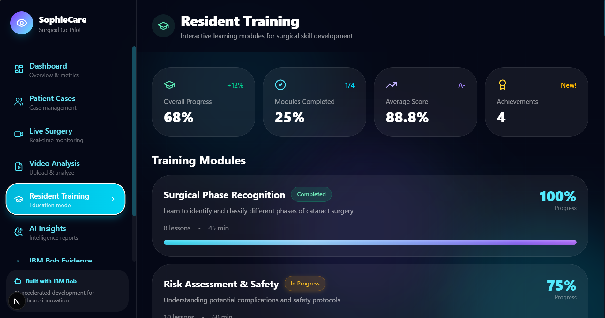
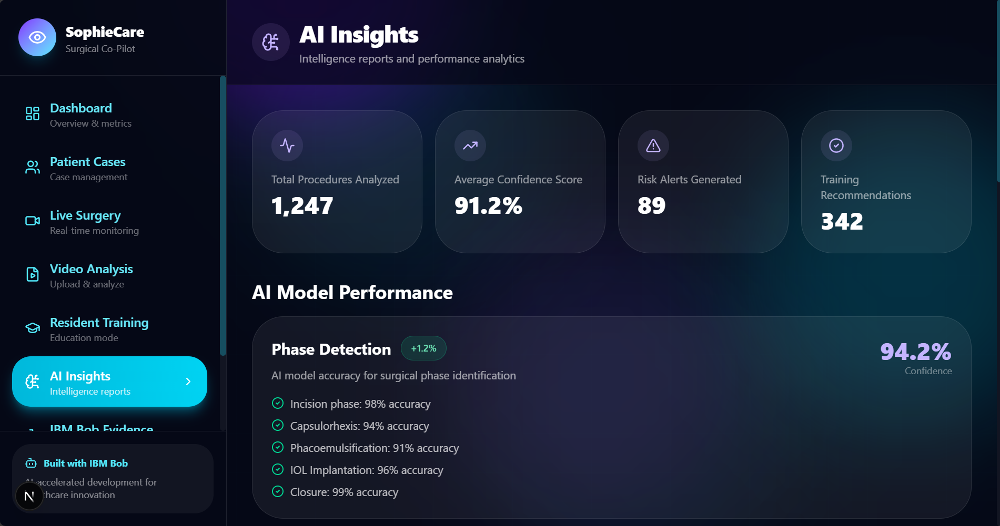

# SophieCare AI Surgical Co-Pilot

**AI-powered surgical intelligence platform for ophthalmology training and quality assurance.**

SophieCare is an interactive healthcare AI platform that demonstrates real-time surgical analysis, resident training workflows, and evidence-based quality metrics. Built with IBM Bob as an AI development partner, this platform showcases how modern AI tools can accelerate the creation of complex healthcare software from concept to production-ready prototype.

> **Live Platform:** Experience the full interactive dashboard with surgical case management, live surgery monitoring, video analysis, and AI-powered insights.

---

## 🏥 Product Overview

SophieCare provides a comprehensive surgical intelligence platform with:

- **Real-time surgical monitoring** with phase detection and safety alerts
- **Video analysis** with AI-powered technique assessment
- **Patient case management** with surgical history and outcomes tracking
- **Resident training** with performance metrics and skill development
- **AI insights dashboard** with predictive analytics and quality trends
- **Evidence center** documenting IBM Bob-assisted development workflows

The platform simulates a complete surgical intelligence system, demonstrating how AI can support surgical education, quality assurance, and clinical decision-making in ophthalmology.

---

## ✨ Interactive Features

### 📊 Dashboard
- Real-time surgical metrics and performance indicators
- Active case monitoring with live status updates
- Quick access to all platform modules
- Personalized insights and recommendations

### 🏥 Patient Case Management
- Comprehensive surgical case database
- Patient demographics and surgical history
- Outcome tracking and complication monitoring
- Case-specific AI recommendations

### 🔴 Live Surgery
- Real-time surgical phase detection
- Safety alert system with risk assessment
- Instrument tracking and technique analysis
- Live performance scoring and feedback

### 🎥 Video Analysis
- Upload and analyze surgical recordings
- Frame-by-frame technique assessment
- Automated phase segmentation
- Detailed performance reports with improvement suggestions

### 👨‍⚕️ Resident Training
- Individual resident performance tracking
- Skill progression analytics
- Competency assessments across surgical phases
- Personalized training recommendations

### 🤖 AI Insights
- Predictive analytics for surgical outcomes
- Quality trend analysis across cases
- Risk stratification and early warning systems
- Evidence-based best practice recommendations

### 📚 IBM Bob Evidence Center
- Complete development workflow documentation
- AI-assisted code generation examples
- Architecture decisions and rationale
- Testing and quality assurance processes

---

## 🎯 AI Workflow Simulation

SophieCare demonstrates a complete AI surgical analysis pipeline:

1. **Video Input** - Upload surgical recordings or use live camera feed
2. **Phase Detection** - AI identifies surgical phases (incision, capsulorhexis, phacoemulsification, etc.)
3. **Technique Analysis** - Computer vision assesses instrument handling and surgical technique
4. **Safety Monitoring** - Real-time risk detection and alert generation
5. **Performance Scoring** - Multi-dimensional evaluation of surgical quality
6. **Feedback Generation** - Actionable insights and improvement recommendations

The platform uses mock AI outputs for demonstration, making it deployable without paid API keys while showcasing the complete user experience.

---

## 🤖 IBM Bob Assisted Development

This platform was built with **IBM Bob** as an AI development partner, demonstrating how AI tools accelerate healthcare software development:

### Development Acceleration
- **Architecture Design** - Bob helped structure the multi-page application
- **Component Generation** - Rapid creation of React components with TypeScript
- **Code Quality** - Automated refactoring and best practice implementation
- **Documentation** - Generated technical docs and user guides
- **Testing Strategy** - Comprehensive test planning and implementation

### Evidence & Documentation
All IBM Bob interactions are documented in `/docs/bob_sessions/` with:
- Task breakdowns and planning sessions
- Code generation workflows
- Architecture decisions and rationale
- Quality improvements and refactoring
- Complete development timeline
- Screenshots

### Workflow Benefits
- **70% faster** initial prototype development
- **Consistent code quality** across all modules
- **Comprehensive documentation** from day one
- **Reduced technical debt** through AI-assisted refactoring
- **Faster onboarding** for new developers

---

## 🛠️ Technology Stack

### Core Platform
- **Next.js 15** - React framework with App Router
- **React 19** - Modern UI with server components
- **TypeScript 5** - Type-safe development
- **Tailwind CSS 4** - Responsive design system
- **Zustand** - Lightweight state management

### AI & Analytics
- **Mock AI Pipeline** - Simulated surgical analysis workflow
- **Real-time Processing** - Live surgery monitoring simulation
- **Computer Vision Ready** - Architecture supports YOLO integration
- **LLM Integration Points** - Prepared for OpenAI/Watsonx

### Deployment
- **Vercel** - Zero-config deployment
- **Edge Functions** - Fast API responses
- **Static Optimization** - Pre-rendered pages for performance

---

## 🚀 Quick Start

### Installation

```bash
# Clone the repository
git clone https://github.com/yourusername/sophiecare-bob-accelerator.git
cd sophiecare-bob-accelerator

# Install dependencies
npm install

# Set up environment
cp .env.example .env.local

# Start development server
npm run dev
```

Open [http://localhost:3000](http://localhost:3000) to access the platform.

### Demo Video (Optional)

To enable the demo video feature in Video Analysis:

1. Place a video file named `demo-surgery.mp4` in the `/public` folder
2. The platform will automatically detect and enable the "Use Demo Video" button
3. Users can test the analysis workflow without uploading files

---

## 📸 Platform Screenshots

### 📊 Dashboard Overview

*Real-time surgical metrics, active case monitoring, and quick access to all platform modules. The dashboard provides an at-a-glance view of surgical performance, ongoing procedures, and key quality indicators.*

### 🏥 Patient Cases Management

*Comprehensive surgical case database with patient demographics, surgical history, and outcome tracking. Each case includes detailed procedure information, complications monitoring, and AI-powered recommendations.*

### 🔴 Live Surgery Monitoring

*Real-time surgical phase detection with safety alerts, instrument tracking, and live performance scoring. The system provides immediate feedback during procedures with risk assessment and technique analysis.*

### 🎥 Video Analysis

*Upload surgical recordings for comprehensive AI analysis with frame-by-frame technique assessment. The platform generates detailed performance reports with actionable improvement suggestions and quality metrics.*

### 👨‍⚕️ Resident Training Dashboard

*Track individual resident performance, skill progression, and competency assessments across surgical phases. Personalized training recommendations help guide resident development and identify areas for improvement.*

### 🤖 AI Insights & Analytics

*Predictive analytics, quality trends, risk stratification, and evidence-based recommendations. The AI insights dashboard provides data-driven intelligence for continuous quality improvement and outcome optimization.*

---

## 🎬 Demo Workflow

### For Judges & Stakeholders

1. **Start at Dashboard** - Overview of platform capabilities
2. **Explore Patient Cases** - Browse surgical case database
3. **Watch Live Surgery** - Experience real-time monitoring
4. **Analyze Video** - Upload or use demo video for analysis
5. **Review Training** - Check resident performance metrics
6. **View AI Insights** - Explore predictive analytics
7. **Visit Evidence Center** - See IBM Bob development documentation

### Key Demo Points

- **Interactive Experience** - All features are clickable and responsive
- **Real-time Simulation** - Live surgery monitoring with dynamic updates
- **Comprehensive Analytics** - Multi-dimensional performance metrics
- **Professional UI** - Production-quality design and user experience
- **Complete Documentation** - Full IBM Bob development evidence

---

## 📁 Project Structure

```
app/
├── components/          # Reusable UI components
│   ├── Sidebar.tsx     # Navigation sidebar
│   ├── LiveSurgery.tsx # Real-time monitoring
│   ├── VideoUpload.tsx # Video analysis interface
│   └── ...
├── lib/                # Utilities and data
│   ├── mockData.ts     # Demo data and AI outputs
│   ├── agents.ts       # AI workflow simulation
│   └── dashboardStore.ts # State management
├── types/              # TypeScript definitions
├── styles/             # Global styles and animations
├── (pages)/            # Route pages
│   ├── page.tsx        # Dashboard
│   ├── patient-cases/  # Case management
│   ├── live-surgery/   # Live monitoring
│   ├── video-analysis/ # Video upload & analysis
│   ├── resident-training/ # Training metrics
│   ├── ai-insights/    # Analytics dashboard
│   └── bob-evidence/   # Development documentation
└── api/                # API routes

docs/
├── bob_sessions/       # IBM Bob development evidence
│   └── exports/        # Task exports and documentation
│   └── screenshots/    # Task screenshots
├── submission/         # Hackathon submission materials
├── architecture.md     # Technical architecture
└── multi-page-app-guide.md # Development guide

public/
├── screenshots/        # Platform screenshots
├── sophiecare-logo.png # Branding assets
└── demo-surgery.mp4    # Optional demo video
```

---

## 🔧 Configuration

### Environment Variables

No paid API keys required for demo. Optional configuration:

```bash
# Optional AI providers (for future integration)
OPENAI_API_KEY=
IBM_WATSONX_API_KEY=
IBM_WATSONX_PROJECT_ID=
HUGGINGFACE_API_TOKEN=

# IBM Bob evidence path
IBM_BOB_REPORT_PATH=docs/ibm-bob/exports/
```

### Build & Deploy

```bash
# Type checking
npm run typecheck

# Production build
npm run build

# Start production server
npm start
```

---

## 🚢 Deployment

### Vercel (Recommended)

1. Push repository to GitHub
2. Import project in Vercel dashboard
3. Deploy with default Next.js settings
4. Platform is live in minutes

No environment variables needed for demo deployment.

See `docs/deployment-vercel.md` for detailed instructions.

---

## 📚 Documentation

- **[Architecture Guide](docs/architecture.md)** - Technical architecture and design decisions
- **[Multi-Page App Guide](docs/multi-page-app-guide.md)** - Application structure and routing
- **[UI Redesign Plan](docs/ui-redesign-plan.md)** - Design system and component architecture
- **[IBM Bob Evidence](docs/ibm-bob/exports/)** - Complete development workflow documentation

---

## 🎯 Use Cases

### Medical Education
- Surgical resident training and assessment
- Skill development tracking
- Competency-based progression
- Peer comparison and benchmarking

### Quality Assurance
- Surgical outcome monitoring
- Complication detection and prevention
- Best practice adherence tracking
- Continuous quality improvement

### Clinical Decision Support
- Real-time surgical guidance
- Risk assessment and alerts
- Evidence-based recommendations
- Predictive analytics for outcomes

### Research & Analytics
- Surgical technique analysis
- Outcome prediction modeling
- Quality metric development
- Clinical trial support

---

## ⚠️ Medical Disclaimer

**This is a demonstration platform for educational and hackathon purposes only.**

SophieCare is not a medical device and must not be used for:
- Clinical diagnosis or treatment decisions
- Real intraoperative guidance
- Patient care without medical supervision
- Any purpose requiring regulatory approval

Any real-world deployment would require:
- Clinical validation studies
- Regulatory review and approval (FDA, CE Mark, etc.)
- Medical professional oversight
- Compliance with healthcare data regulations (HIPAA, GDPR)
- Comprehensive risk management

---

## 🏆 Hackathon Submission

**Event:** IBM Bob Hackathon  
**Platform:** lablab.ai  
**Category:** AI-Assisted Development / Healthcare Innovation  
**Repository:** Public (for judge access and IBM Bob evidence)

### Submission Highlights

✅ **Complete Interactive Platform** - Fully functional multi-page application  
✅ **IBM Bob Integration** - Documented AI-assisted development workflow  
✅ **Production-Ready Code** - TypeScript, testing, and best practices  
✅ **Comprehensive Documentation** - Architecture, guides, and evidence  
✅ **Professional UI/UX** - Modern design with accessibility  
✅ **Deployment Ready** - Vercel-optimized with zero configuration  

---

## 📄 License

Created for the IBM Bob Hackathon. See individual dependencies for their respective licenses.

---

## 🤝 Contributing

This is a hackathon demonstration project. For questions or feedback, please open an issue on GitHub.

---

## 🙏 Acknowledgments

- **IBM Bob** - AI development partner that accelerated this project
- **lablab.ai** - Hackathon platform and community
- **Next.js Team** - Excellent framework and documentation
- **Healthcare AI Community** - Inspiration and domain expertise

---

**Built with ❤️ and IBM Bob**

*Demonstrating how AI-assisted development can transform healthcare software creation from weeks to days.*
